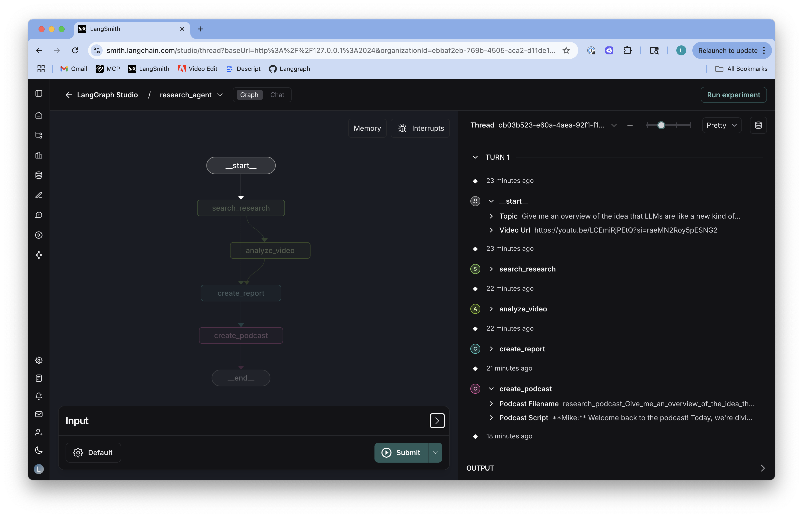

# Multi-Modal Researcher

This project is a simple research and podcast generation workflow that uses LangGraph with the unique capabilities of Google's Gemini 2.5 model family. It combines three useful features of the Gemini 2.5 model family. You can pass a research topic and, optionally, a YouTube video URL. The system will then perform research on the topic using search, analyze the video, combine the insights, and generate a report with citations as well as a short podcast on the topic for you. It takes advantage of a few of Gemini's native capabilities:

- 🎥 [Video understanding and native YouTube tool](https://developers.googleblog.com/en/gemini-2-5-video-understanding/): Integrated processing of YouTube videos
- 🔍 [Google search tool](https://developers.googleblog.com/en/gemini-2-5-thinking-model-updates/): Native Google Search tool integration with real-time web results
- 🎙️ [Multi-speaker text-to-speech](https://ai.google.dev/gemini-api/docs/speech-generation): Generate natural conversations with distinct speaker voices


## Quick Start

### Prerequisites

- Python 3.11+
- [uv](https://docs.astral.sh/uv/) package manager
- Google Gemini API key

### Setup

1. **Set up environment variables**:

Edit `.env` and [add your Google Gemini API key](https://ai.google.dev/gemini-api/docs/api-key):
```bash
GEMINI_API_KEY=your_api_key_here
```

3. **Run the development server**:

```bash
# Install uv package manager
curl -LsSf https://astral.sh/uv/install.sh | sh

# Install dependencies and start the LangGraph server
uvx --refresh --from "langgraph-cli[inmem]" --with-editable . --python 3.11 langgraph dev --allow-blocking
```

4. **Access the application**:

LangGraph will open in your browser.

```bash
╦  ┌─┐┌┐┌┌─┐╔═╗┬─┐┌─┐┌─┐┬ ┬
║  ├─┤││││ ┬║ ╦├┬┘├─┤├─┘├─┤
╩═╝┴ ┴┘└┘└─┘╚═╝┴└─┴ ┴┴  ┴ ┴

- 🚀 API: http://127.0.0.1:2024
- 🎨 Studio UI: https://smith.langchain.com/studio/?baseUrl=http://127.0.0.1:2024
- 📚 API Docs: http://127.0.0.1:2024/docs
```

5. Pass a `topic` and optionally a `video_url`.

Example:
* `topic`: Give me an overview of the idea that LLMs are like a new kind of operating system.
* `video_url`: https://youtu.be/LCEmiRjPEtQ?si=raeMN2Roy5pESNG2




Result:

[🔍 See the example report](./example/report/response.md)

[▶️ Download the example podcast](./example/audio/audio.wav)

## Architecture

The system implements a LangGraph workflow with the following nodes:

1. **Search Research Node**: Performs web search using Gemini's Google Search integration
2. **Analyze Video Node**: Analyzes YouTube videos when provided (conditional)
3. **Create Report Node**: Synthesizes findings into a comprehensive markdown report
4. **Create Podcast Node**: Generates a 2-speaker podcast discussion with TTS audio

### Workflow

```
START → search_research → [analyze_video?] → create_report → create_podcast → END
```

The workflow conditionally includes video analysis if a YouTube URL is provided, otherwise proceeds directly to report generation.

### Output

The system generates:

- **Research Report**: Comprehensive markdown report with executive summary and sources
- **Podcast Script**: Natural dialogue between Dr. Sarah (expert) and Mike (interviewer)  
- **Audio File**: Multi-speaker TTS audio file (`research_podcast_*.wav`)

## Configuration

The system supports runtime configuration through the `Configuration` class:

### Model Settings
- `search_model`: Model for web search (default: "gemini-2.5-flash")
- `synthesis_model`: Model for report synthesis (default: "gemini-2.5-flash")
- `video_model`: Model for video analysis (default: "gemini-2.5-flash")
- `tts_model`: Model for text-to-speech (default: "gemini-2.5-flash-preview-tts")

### Temperature Settings
- `search_temperature`: Factual search queries (default: 0.0)
- `synthesis_temperature`: Balanced synthesis (default: 0.3)
- `podcast_script_temperature`: Creative dialogue (default: 0.4)

### TTS Settings
- `mike_voice`: Voice for interviewer (default: "Kore")
- `sarah_voice`: Voice for expert (default: "Puck")
- Audio format settings for output quality

## Project Structure

```
├── src/agent/
│   ├── state.py           # State definitions (input/output schemas)
│   ├── configuration.py   # Runtime configuration class
│   ├── utils.py          # Utility functions (TTS, report generation)
│   └── graph.py          # LangGraph workflow definition
├── langgraph.json        # LangGraph deployment configuration
├── pyproject.toml        # Python package configuration
└── .env                  # Environment variables
```

## Key Components

### State Management

- **ResearchStateInput**: Input schema (topic, optional video_url)
- **ResearchStateOutput**: Output schema (report, podcast_script, podcast_filename)
- **ResearchState**: Complete state including intermediate results

### Utility Functions

- **display_gemini_response()**: Processes Gemini responses with grounding metadata
- **create_podcast_discussion()**: Generates scripted dialogue and TTS audio
- **create_research_report()**: Synthesizes multi-modal research into reports
- **wave_file()**: Saves audio data to WAV format

## Deployment

The application is configured for deployment on:

- **Local Development**: Using LangGraph CLI with in-memory storage
- **LangGraph Platform**: Production deployment with persistent storage
- **Self-Hosted**: Using Docker containers

## Dependencies

Core dependencies managed via `pyproject.toml`:

- `langgraph>=0.2.6` - Workflow orchestration
- `google-genai` - Gemini API client
- `langchain>=0.3.19` - LangChain integrations
- `rich` - Enhanced terminal output
- `python-dotenv` - Environment management


